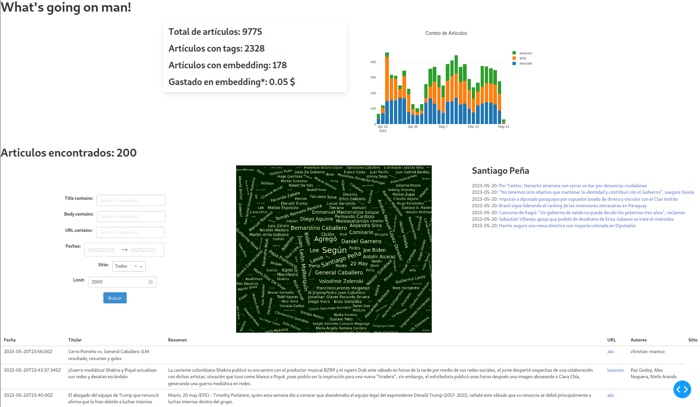

# Briefly News
LLM powered news briefings.

## Build and test
You need python >=3.9 with venv installed.
    
    make clean
    make venv
    make test

This will create a virtual environment in the `venv` directory
and install the necessary dependencies.
# Documentation

To generate the documentation,

    make doc

This will generate markdowns with the compiled docstrings in the _build directory. Run this only from `doc` folder!

It will also build a readthedocs style website in the folder `doc/site/index.html`.

## Frontend

Start the local dash frontend with 

    make frontend

Stop the frontend with

    make frontend-stop

## Routines

### Scraping

    make scrape LIMIT=10 BRANCH=dev

This will scrape the websites for new articles by going through each category 
and then each article url to get all the information. 

### Embedding

    make embed LIMIT=10

This command will embed articles without embeddings using the OpenAI key 
provided in .env, with the `ada-002` embedder, and uploading the results 
to the database (watchout for the costs).

### Tagging
You can tag articles locally using spacy library with the command

    make tag LIMIT=10

This will tag previously untagged articles by tagging the article titles 
and body using `spacy` library and `es_core_news_md` module and looking for 
`'PER'` tagged words and add them to the `POIs` field of each article, and 
finally upload the tags to the database..

## Project Structure
* backend
    * database
        * ✔ XataAPI interface
        * data models in yml/json
        * Automatic first-time table creation.

    * scraper  
        * ✔ ABC (arc-pub API) 
        * ✔ UltimaHora (arc-pub API)
        * LaNacion
        * 5Dias
    
    * LLM
        * Embedder interface
            * ✔ encodes every document (a news article)
            * vector database search
        * summary script
            * given a date and a prompt, return a summary of the most relevant news that day
            * store summary in cloud (s3 type storage)

* frontend
    * static website

* devops
    * docker
    * ✔️ github actions
